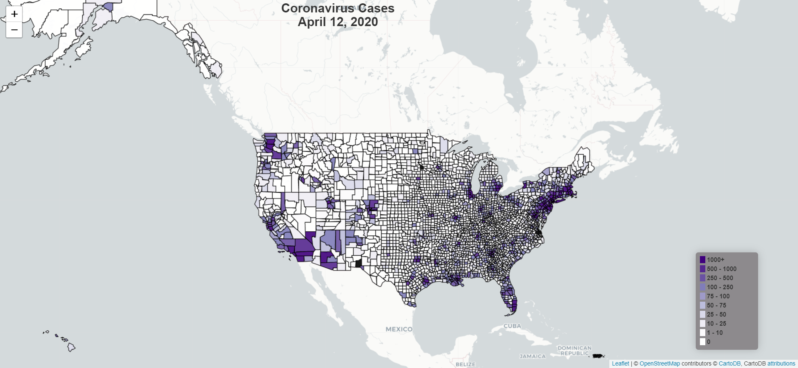
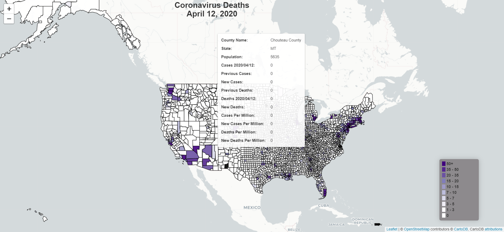

# CoronavirusMapAnimation
Creating an animated heatmap of daily coronavirus cases

I am testing out a simple-ish way to create videos showing how the Coronavirus spread through the United States. I created 4 videos of county-level Coronavirus data-- Case Counts, Death Counts, Cases Per Million People, and Deaths Per Million People. 

If link does not work, please go to the animations folder and download mp4 to see the animation. 

## Data were downloaded from USA Facts
https://usafacts.org/visualizations/coronavirus-covid-19-spread-map/

## Shape files were downloaded from the Census Bureau
   https://www.census.gov/geographies/mapping-files/time-series/geo/tiger-line-file.html

## Next, I turned these into geojson format by using this site:
   https://mapshaper.org/

## I generated day-specific geojson files
Using the 2019 geojson file as a blank template, I created one geojson file for each day in 2020 (anticipating more data later).  Then I merged county-level information onto those json files.

I used Python/Follium to create HTML maps for each day between January 22 and June 2.  Then using selenium I opened each file in a web browser and took a screen shot.  Finally, I reshaped and combined these images using PIL/Image and then put them together into an mp4 file using imageio.  

There is still a lot of cleaning up to do and many more animations to do!
